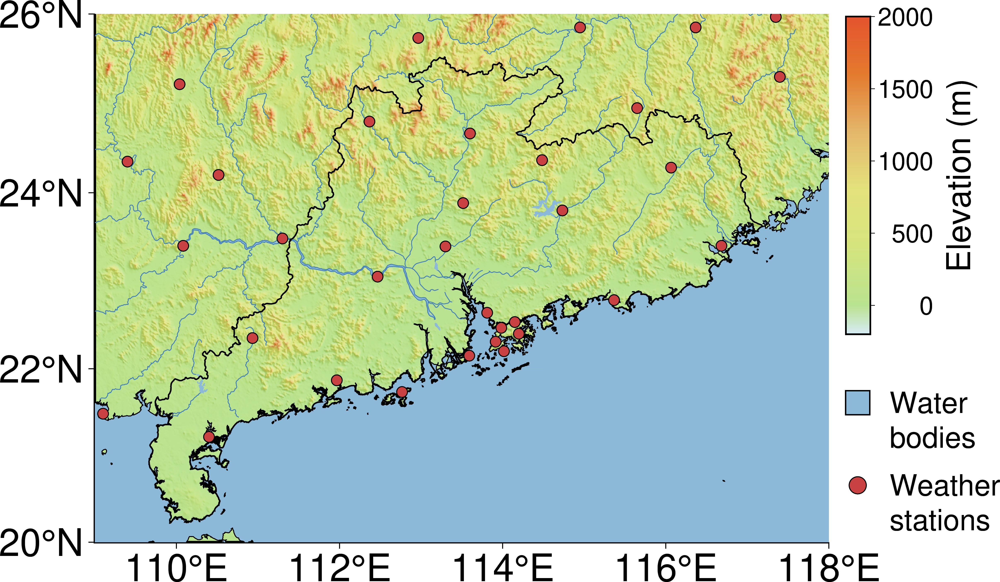
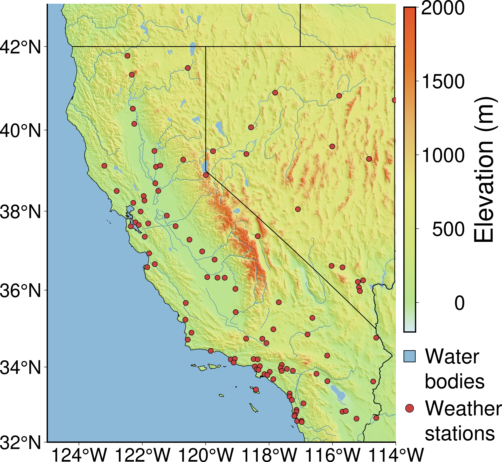
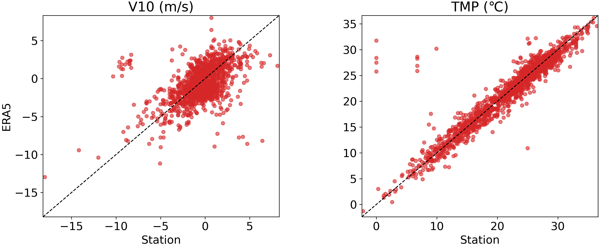
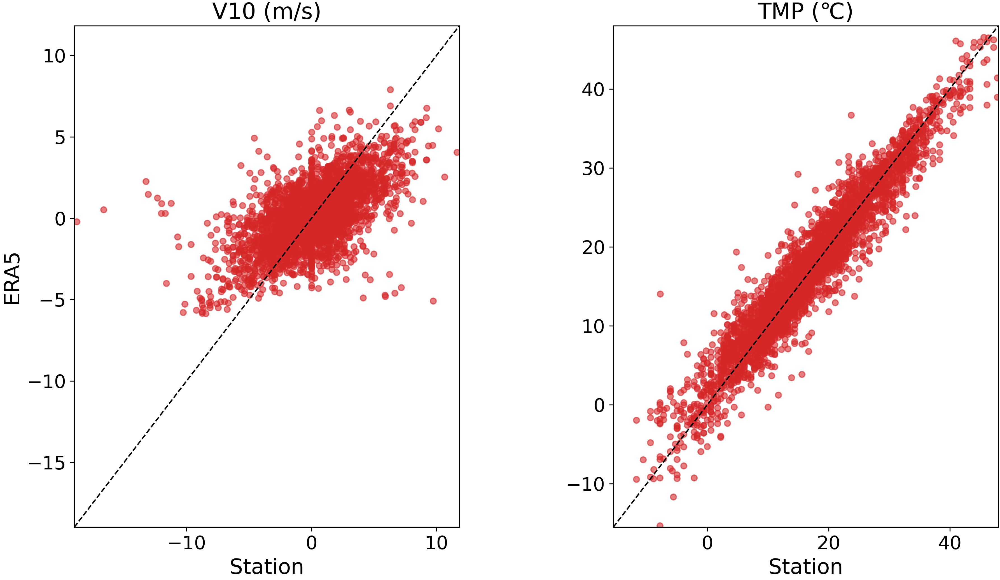
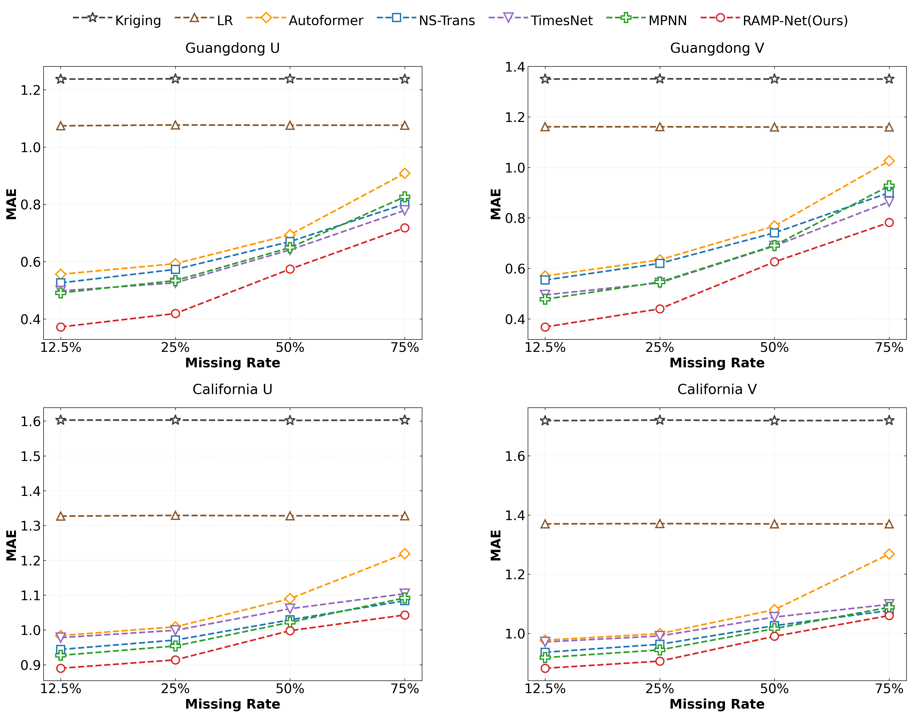
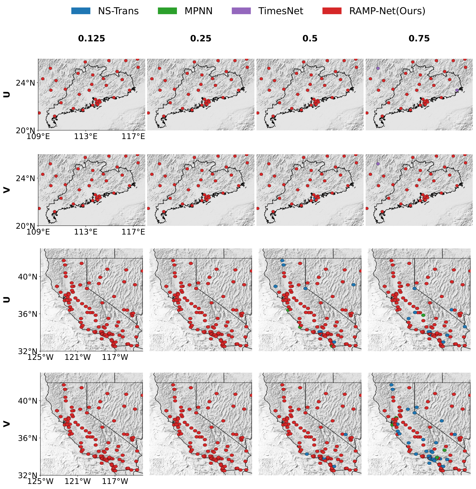
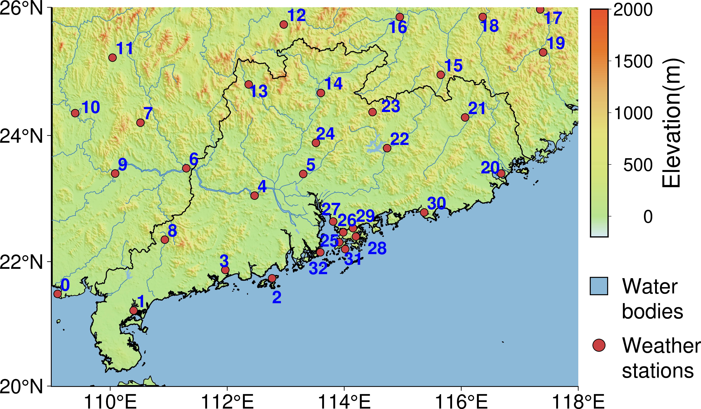
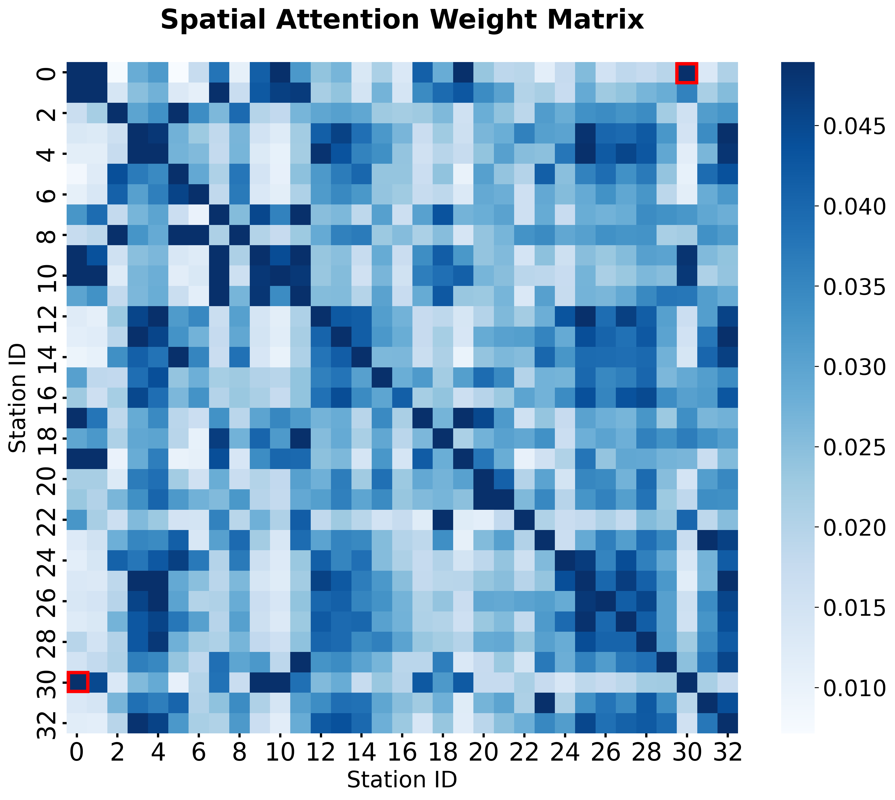
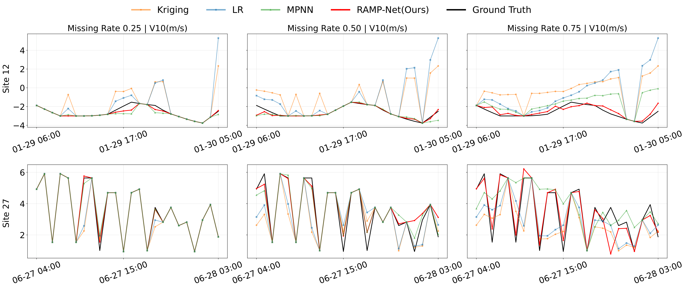
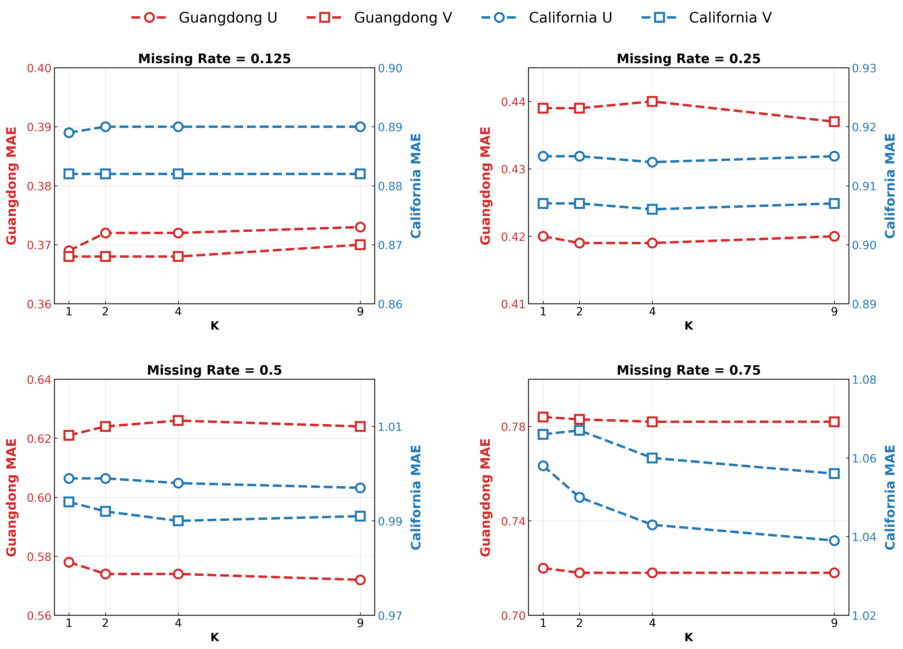

<div align="center">

# RAMP-Net

### Reanalysis-Infused Attentive Message Passing for Multi-Station Meteorological Imputation

[](https://www.python.org/)
[](https://pytorch.org/)
[](LICENSE)
[](https://drive.google.com/drive/folders/1Lm8lddu4-yTe54fitGt2sFfIIb3k2sMv?usp=sharing)

Official implementation accompanying the *Computers & Geosciences* manuscript.

[Processed data](https://drive.google.com/drive/folders/1Lm8lddu4-yTe54fitGt2sFfIIb3k2sMv?usp=sharing) · [Quick test](#quick-test) · [Full experiments](#reproducing-the-experiments) · [License](#license-and-citation)

</div>

RAMP-Net reconstructs missing meteorological station observations by combining the spatially complete physical background of ERA5 reanalysis with dynamic dependencies learned across stations. The model first transfers information from nearby ERA5 grid cells to each station, then refines the coarse estimate through temporal and inter-station attention.

## Highlights

- **Reanalysis-guided reconstruction:** uses ERA5 fields as physically meaningful priors instead of treating them as ordinary auxiliary features.
- **Dynamic message passing:** learns time-varying station relationships conditioned on meteorological features and geographic coordinates.
- **Coarse-to-fine imputation:** aligns gridded reanalysis with point observations before station-scale refinement.
- **Two distinct study regions:** evaluates 33 stations in Guangdong and 103 stations in California across four meteorological variables and four missing rates.
- **Reproducible release:** provides model and baseline code, regional normalization statistics, experiment scripts, a dependency specification, and a data-free CPU quick test.

## Method Overview

<p align="center">
  
</p>
<p align="center"><em>Coarse-to-fine reconstruction using ERA5 background fields and station observations.</em></p>

<p align="center">
  
</p>
<p align="center"><em>RAMP-Net architecture: reanalysis prior infusion, temporal attention, and attentive inter-station message passing.</em></p>

## Study Regions and Data Characteristics

The experiments use hourly station observations from WEATHER-5K and ERA5 single-level reanalysis for 2018--2019. The target variables are 2-m temperature (`TMP`), mean sea-level pressure (`msl`), and the 10-m zonal and meridional wind components (`u10` and `v10`).

<table>
  <tr>
    <td align="center" width="50%"></td>
    <td align="center" width="50%"></td>
  </tr>
  <tr>
    <td align="center"><strong>Guangdong, China</strong><br>33 stations; monsoon, coastal, plain, hill, and mountain influences.</td>
    <td align="center"><strong>California, USA</strong><br>103 stations; coastal, valley, desert, and strong orographic contrasts.</td>
  </tr>
</table>

<table>
  <tr>
    <td align="center" width="50%"></td>
    <td align="center" width="50%"></td>
  </tr>
  <tr>
    <td align="center">Guangdong station--ERA5 comparison</td>
    <td align="center">California station--ERA5 comparison</td>
  </tr>
</table>

Temperature follows the ERA5 background relatively closely, whereas station wind observations show stronger local variability. This scale mismatch motivates explicit grid-to-station alignment rather than direct feature concatenation.

## Processed Experimental Data

The complete processed experimental data are available in the following public Google Drive folder. The two archives are named `California.rar` and `Guangdong.rar`.

> **Download:** [RAMP-Net complete processed experimental data](https://drive.google.com/drive/folders/1Lm8lddu4-yTe54fitGt2sFfIIb3k2sMv?usp=sharing)

| Archive | Compressed size | Extracted size | Stations | ERA5 grid points |
|---|---:|---:|---:|---:|
| `California.rar` | about 711 MiB | about 1.41 GiB | 103 | 1681 |
| `Guangdong.rar` | about 342 MiB | about 696 MiB | 33 | 925 |

Download `California.rar` or `Guangdong.rar` and preserve the archive file. Each archive is self-contained and has the same layout; prepare one region at a time because the training code reads the active region selected by `--region`.

After extraction, the relevant layout should be:

```text
RAMP-Net/
|-- California/                  # created by extracting California.rar
|   |-- all_data_TMP/            # station CSV files
|   |-- all_data_msl/
|   |-- all_data_u10/
|   |-- all_data_v10/
|   |-- metadata_5K.json
|   |-- metadata_5K_sorted.json
|   |-- TMP/                     # processed arrays
|   |-- msl/
|   |-- u10/
|   `-- v10/
|-- Guangdong/                   # same structure after extracting Guangdong.rar
|-- code/
|   |-- mask_rate/               # generated automatically per region/rate
|   `-- scaler/California|Guangdong/
|-- prepare_data.py
`-- quick_test.py
```

Each variable directory must contain the processed training, validation, test, reanalysis, and coordinate arrays used by `code/data_provider/data_factory_2.py`, including:

```text
X_train_all.npy       X_train_all_e.npy
X_val_all.npy         X_val_all_e.npy
X_test_all.npy        X_test_all_e.npy
locations.npy         locations_e.npy
```

The archives do not contain synthetic missingness masks. On first use, the code creates deterministic MCAR masks under `code/mask_rate/<Region>/<missing-rate>/`, with filenames such as `train_mask_u10_0.npy`. Masks are generated from the region, variable, missing rate, split, and repetition index, so rerunning the same configuration reproduces them exactly. The Google Drive folder therefore supplies the complete observation/reanalysis arrays; the experiment masks are reproducibly generated by this repository.

### Extract and validate an archive

From the repository root, run one of:

```bash
python prepare_data.py D:/path/to/California.rar
python prepare_data.py D:/path/to/Guangdong.rar
```

The helper uses 7-Zip (install [7-Zip](https://www.7-zip.org/) or a compatible `7z` executable), checks all four variables, verifies the expected 12000/1680/3840 time splits, and reports the station and ERA5-grid counts. To validate an already extracted region without extracting again:

```bash
python prepare_data.py --region California --check-only
python prepare_data.py --region Guangdong --check-only
```

The verified archive contents are 103 stations and 1681 ERA5 grids for California, and 33 stations and 925 ERA5 grids for Guangdong. The processed arrays are float64 and contain the eight core files listed above for each variable.

The original upstream data sources remain available separately:

- [WEATHER-5K](https://github.com/thanadol-git/WEATHER-5K)
- [ERA5 single-level reanalysis](https://cds.climate.copernicus.eu/datasets/reanalysis-era5-single-levels)

The Google Drive data are distributed separately from GitHub because of their size. WEATHER-5K and ERA5 remain subject to their original terms.

## Installation

Python 3.10 or 3.11 is recommended. Linux is recommended for the published shell scripts, and an NVIDIA GPU is recommended for full experiments.

```bash
git clone https://github.com/gyla1993/RAMP-Net.git
cd RAMP-Net

python -m venv .venv
source .venv/bin/activate
python -m pip install --upgrade pip
python -m pip install -r requirements.txt
```

Install the CUDA-specific PyTorch build using the [official selector](https://pytorch.org/get-started/locally/) when required. See the [PyTorch Geometric installation guide](https://pytorch-geometric.readthedocs.io/en/latest/install/installation.html) if a platform-specific wheel is needed.

## Quick Test

The quick test does not require WEATHER-5K, ERA5, or the Google Drive data. It creates a small synthetic station/grid problem, performs a complete RAMP-Net forward pass on CPU, and verifies that the outputs are finite and correctly shaped.

```bash
python quick_test.py
```

Expected output:

```text
RAMP-Net quick test passed
output shape: (2, 5, 8, 1)
attention shape: (2, 5, 5)
```

## Reproducing the Experiments

Run experiment commands from `code/` because the checkpoint and output paths are relative to that directory. Set `REGION` to match the processed regional directory at the repository root. The data root is `..` by default, so the expected paths are `../California/u10`, `../Guangdong/u10`, and so on. Both `run.py` and `run_s.py` read the `REGION` and optional `DATA_ROOT` environment variables, so the same convention also works for baseline scripts.

### California

```bash
cd code
REGION=California bash scripts/RAMP-Net/RAMP-Net_u10.sh
REGION=California bash scripts/RAMP-Net/RAMP-Net_v10.sh
REGION=California bash scripts/RAMP-Net/RAMP-Net_TMP.sh
REGION=California bash scripts/RAMP-Net/RAMP-Net_msl.sh
```

### Guangdong

```bash
cd code
REGION=Guangdong bash scripts/RAMP-Net/RAMP-Net_u10.sh
REGION=Guangdong bash scripts/RAMP-Net/RAMP-Net_v10.sh
REGION=Guangdong bash scripts/RAMP-Net/RAMP-Net_TMP.sh
REGION=Guangdong bash scripts/RAMP-Net/RAMP-Net_msl.sh
```

The scripts run seeds `2024`--`2028` at missing rates `0.125`, `0.25`, `0.50`, and `0.75`. The published RAMP-Net configuration uses a 24-hour input window, four neighboring ERA5 grid points, batch size 6, up to 50 epochs, and early stopping with patience 3.

For inference, keep the corresponding script arguments and change `--is_training 1` to `--is_training 0`. For CPU execution, pass `--no-use_gpu` and omit `--use_multi_gpu`.

## Implemented Methods

| Category | Methods |
|---|---|
| Proposed | **RAMP-Net**, RAMP-Net ablations |
| Geostatistical | Kriging |
| Single-station | Linear Regression, Autoformer, TimesNet, Non-stationary Transformer |
| Multi-station | MPNN |

Baseline scripts are available under `code/scripts/Autoformer`, `Kriging`, `LR`, `MPNN`, `Non-stationary Transformer`, and `TimesNet`.

The Kriging baseline automatically fits and caches region- and variable-specific weights as `pure_kriging_weights_norm.csv` inside the active variable directory on its first run. Later runs reuse that file.

## Results and Analysis

### Robustness to Missingness

<p align="center">
  
</p>
<p align="center"><em>MAE trends for the U and V wind components across increasing missing rates.</em></p>

### Station-Level Model Distribution

<p align="center">
  
</p>
<p align="center"><em>Spatial distribution of the best-performing imputation method at each station.</em></p>

### Dynamic Spatial Dependencies

<table>
  <tr>
    <td align="center" width="43%"></td>
    <td align="center" width="57%"></td>
  </tr>
  <tr>
    <td align="center">Station geography and Hilbert ordering</td>
    <td align="center">Learned station-to-station attention</td>
  </tr>
</table>

The attention pattern captures both geographically local station groups and longer-range relationships associated with similar terrain and atmospheric forcing.

### Temporal Reconstruction

<p align="center">
  
</p>
<p align="center"><em>Example reconstructions for stable and strongly fluctuating station series under different missing rates.</em></p>

### Neighbor Sensitivity

<p align="center">
  
</p>
<p align="center"><em>Sensitivity to the number of neighboring ERA5 grid cells. K=4 provides the selected accuracy--efficiency trade-off.</em></p>

## Repository Structure

```text
RAMP-Net/
|-- code/
|   |-- data_provider/   Data loading and preprocessing
|   |-- docs/            Architecture and experimental figures
|   |-- exp/             Training and evaluation pipelines
|   |-- layers/          Neural network building blocks
|   |-- mask_rate/       Deterministic missing-value masks (generated locally)
|   |-- models/          RAMP-Net, ablations, and baselines
|   |-- scaler/          Regional normalization statistics
|   |-- scripts/         Reproduction scripts by method and variable
|   |-- utils/           Metrics and utilities
|   |-- run.py           Multi-station entry point
|   `-- run_s.py         Single-station entry point
|-- quick_test.py        Synthetic CPU smoke test
|-- requirements.txt    Python dependencies
|-- LICENSE             MIT License
`-- README.md
```

## Outputs and Reproducibility

- Checkpoints are written below `code/checkpoints/`.
- Test arrays and metrics are written below `code/test_results/` and `code/results/`.
- Entry points set deterministic seeds; published scripts run five independent seeds.
- Regional normalization statistics are included under `code/scaler/California` and `code/scaler/Guangdong`.
- The quick test verifies installation and core-model execution; it is not a substitute for reproducing the manuscript tables.

## License and Citation

The RAMP-Net source code and documentation are released under the [MIT License](LICENSE). Dataset and third-party model licenses are unchanged.

Please cite the accompanying *Computers & Geosciences* manuscript when using this repository. The final bibliographic entry will be added after publication.
